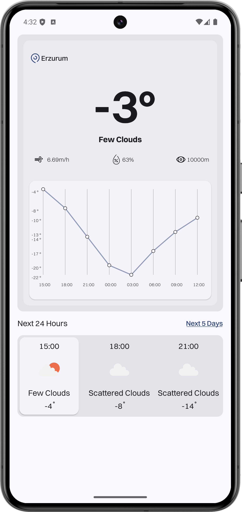
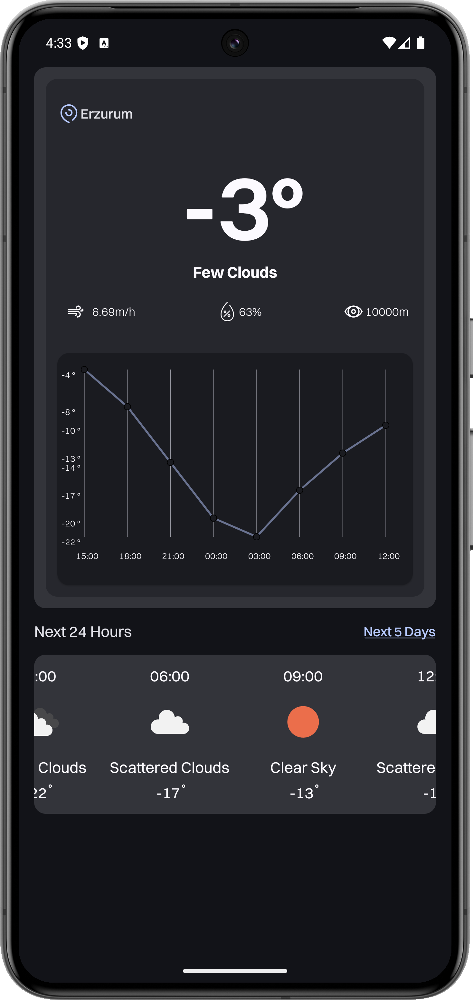
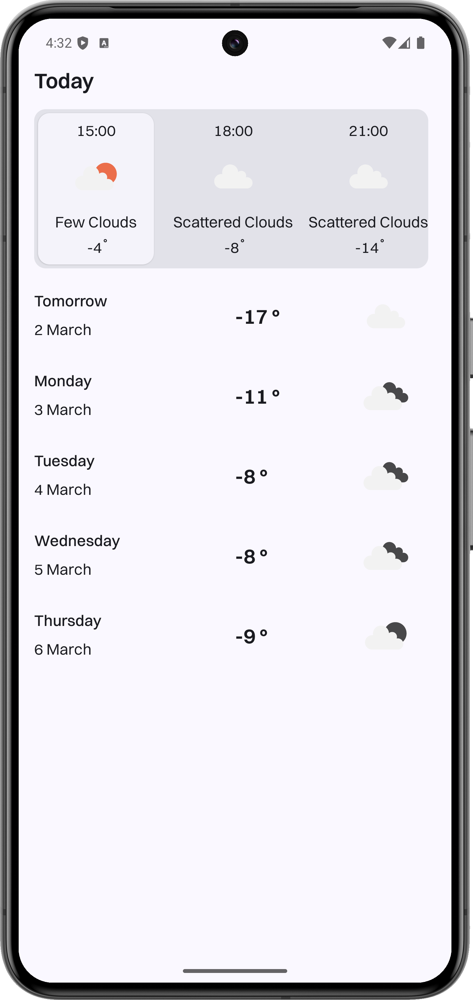
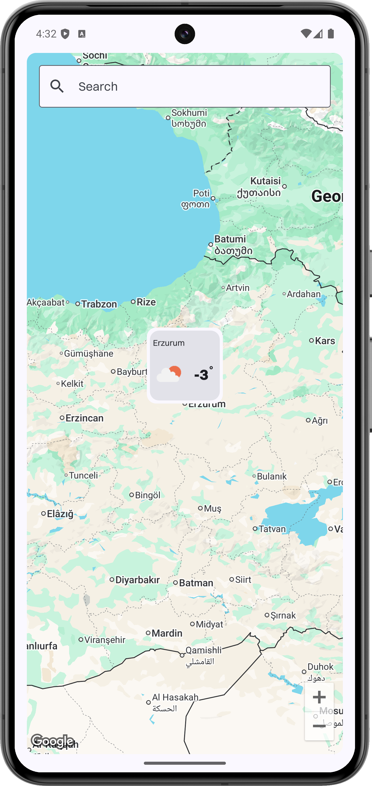
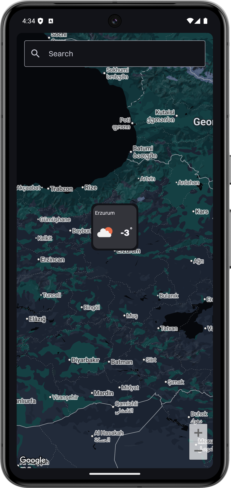
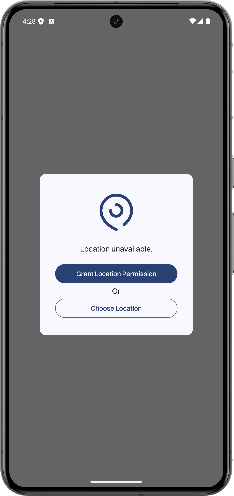
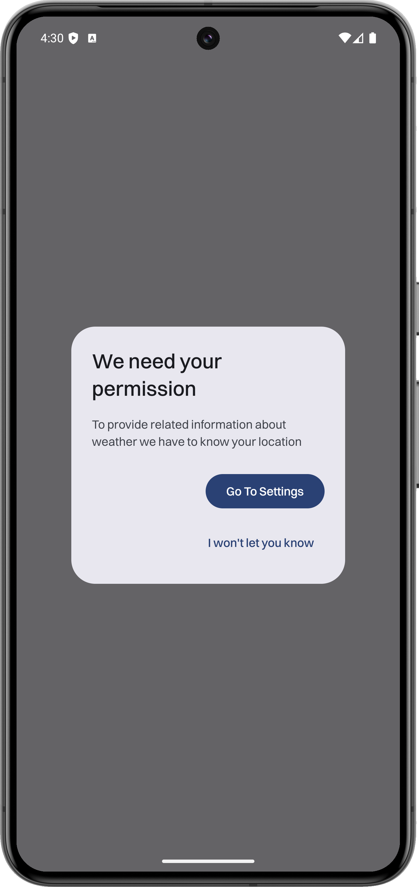

# Celestia Weather App

A modern Android weather application built with Clean Architecture principles and modular design, providing real-time weather information.

## 📱 Screenshots

<div style="display: flex; justify-content: space-between; flex-wrap: wrap;">
  
  
  
</div>

<div style="display: flex; justify-content: space-between; flex-wrap: wrap;">
  
  
  
</div>

<div style="display: flex; justify-content: space-between; flex-wrap: wrap;">
  
</div>

## 🏗️ Architecture & Modularization

The app follows Clean Architecture principles with a modular structure: 

```
app/
├── core/
│   ├── network/            # Network operations and API interfaces
│   ├── data/               # Data layer, repositories
│   ├── model/              # Domain models
│   ├── domain/             # Use cases, business logic
│   ├── ui/                 # Common UI components
│   ├── designsystem/       # Design system, themes
│   ├── common/             # Shared utilities
│   ├── testing/            # Test utilities
│   └── androidtest/        # Android test utilities
│
└── feature/
    ├── home/               # Home screen with current weather
    ├── detail/             # Detailed weather information
    └── location/           # Location selection
```

### Module Dependencies

- **app**: Main application module, depends on all feature modules
- **core**: Contains all core functionality and shared resources
- **feature**: Contains all feature modules, each independent of others

## 🛠️ Tech Stack

### Core
- **Kotlin**: Primary programming language
- **Coroutines & Flow**: Asynchronous programming
- **Hilt**: Dependency injection
- **Jetpack Compose**: Modern UI toolkit
- **Material 3**: Design system
- **Clean Architecture**: Architectural pattern
- **MVVM**: Presentation layer pattern

### Features
- **Google Maps**: Location services
- **Location Services**: Real-time weather data
- **Retrofit**: Network requests
- **OkHttp**: HTTP client

### Testing
- **JUnit 5**: Unit testing
- **Mockk**: Mocking framework
- **Turbine**: Flow testing
- **Compose Testing**: UI testing

## 🌟 Features

- Real-time weather information
- Location-based weather data
- 5-day weather forecast
- Detailed weather metrics (humidity, wind speed, visibility)
- Location search with Google Maps integration
- Material 3 theming
- Dark/Light mode support
- Error handling and retry mechanisms
- Location permissions handling

## 🚀 Getting Started

1. Clone the repository
git clone https://github.com/yourusername/celestia-weather.git

2. Add your API keys in `local.properties`:
MAPS_API_KEY=your_google_maps_api_key
WEATHER_API_KEY=your_weather_api_key

3. Build and run the project in Android Studio

## 📦 Dependencies Management

The project uses a custom Gradle plugin for dependency management with version catalogs:
kotlin
// Example from build.gradle.kts
dependencies {
implementation(projects.core.network)
implementation(projects.core.data)
implementation(projects.core.model)
// ...
implementation(libs.androidx.ktx)
implementation(libs.androidx.lifecycle.runtime.ktx)
implementation(libs.bundles.compose)
// ...
}


## 🧪 Testing Strategy

- **Unit Tests**: Testing individual components (ViewModels, UseCases, Repositories)
- **Integration Tests**: Testing interactions between components
- **UI Tests**: Testing UI components with Compose Testing

## 📱 Supported Devices

- Android 8.0 (API 26) and above
- Phones and tablets
- Dark and light mode

## 🤝 Contributing

Contributions are welcome! Please feel free to submit a Pull Request.

1. Fork the repository
2. Create your feature branch (`git checkout -b feature/amazing-feature`)
3. Commit your changes (`git commit -m 'Add some amazing feature'`)
4. Push to the branch (`git push origin feature/amazing-feature`)
5. Open a Pull Request

## 📄 License

This project is licensed under the MIT License - see the [LICENSE](LICENSE) file for details.

## 👤 Author

Sevban Buyer - [@sevbanbuyer](https://github.com/sevbanbuyer)
